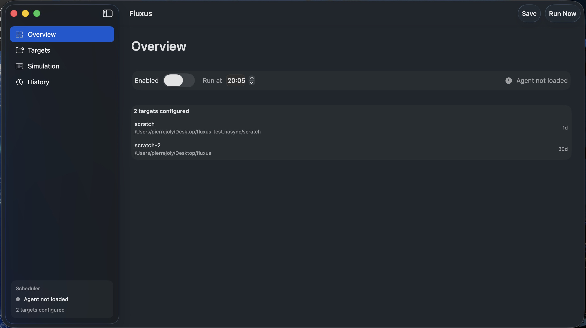
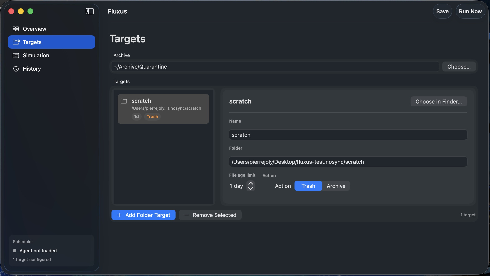
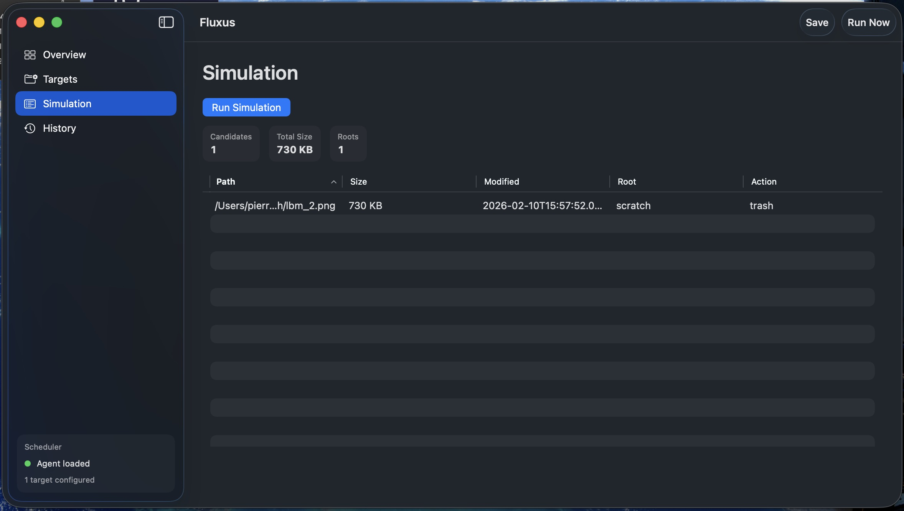
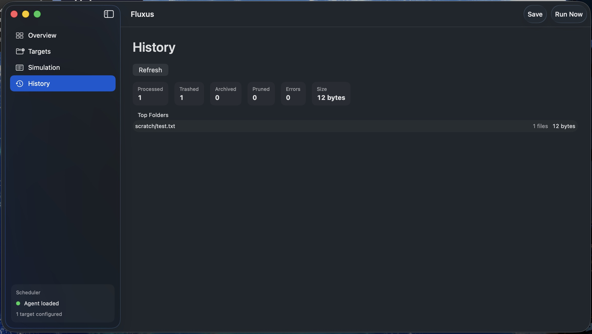
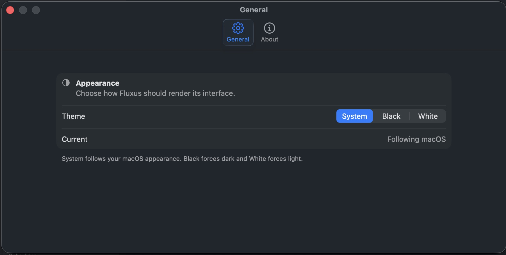
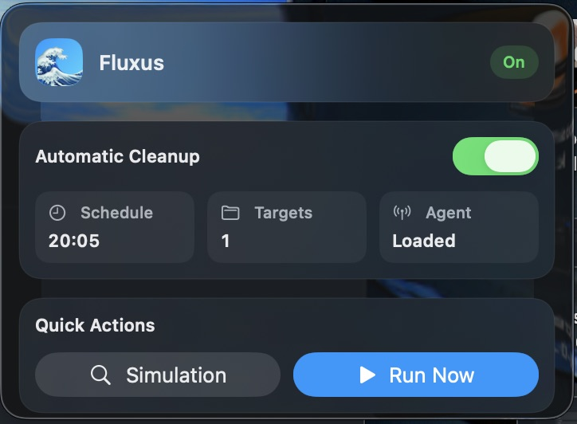

# Fluxus

Fluxus is a local-only macOS utility app that cleans configured folders on a daily schedule.

It includes:

- A SwiftUI desktop app (`Fluxus`) for configuration and monitoring.
- A bundled CLI helper (`Fluxusctl`) that performs validation, simulation, and cleanup.
- A user `launchd` LaunchAgent so cleanup still runs when the app is closed.
- A menu bar Control Center (Overview panel) for quick status and actions.

No cloud. No external services.

## Visual Tour

Replace the placeholder images below with your screenshots when you are ready.

### Dashboard • Overview



### Dashboard • Targets



### Dashboard • Simulation



### Dashboard • History



### Settings • General



### Control Center (Menu Bar)



## Screenshot Workflow

1. Capture screenshots of each panel/window.
2. Replace files in `docs/images/` (keep the same filenames), or update image paths in this README.
3. Commit updated assets.

## Requirements

- macOS 13+
- Xcode 15+ (Swift 5.9+)

## Project Layout

- `Fluxus.xcodeproj` - app + helper + tests
- `Fluxus/` - SwiftUI app target
- `Fluxusctl/` - command-line helper target
- `Shared/` - shared models and cleanup engine
- `FluxusTests/` - unit tests
- `FluxusUITests/` - UI regression tests
- `Examples/config.example.json` - example configuration

## Build

```bash
xcodebuild -project Fluxus.xcodeproj \
  -scheme Fluxus \
  -configuration Debug \
  -destination 'platform=macOS' \
  CODE_SIGNING_ALLOWED=NO \
  build
```

Bundled helper path:

```text
Fluxus.app/Contents/MacOS/Fluxusctl
```

## Build Release App (`.app`)

Build a Release app bundle in `dist/`:

```bash
./scripts/build-release.sh
```

This produces:

```text
dist/Fluxus.app
dist/Fluxus.app.dSYM
```

Copy directly to `/Applications`:

```bash
./scripts/build-release.sh --install
```

## Run Tests

Unit tests:

```bash
xcodebuild -project Fluxus.xcodeproj \
  -scheme Fluxus \
  -configuration Debug \
  -destination 'platform=macOS' \
  CODE_SIGNING_ALLOWED=NO \
  -skip-testing:FluxusUITests \
  test
```

UI tests:

```bash
xcodebuild -project Fluxus.xcodeproj \
  -scheme Fluxus \
  -configuration Debug \
  -destination 'platform=macOS' \
  -only-testing:FluxusUITests/FluxusUITests \
  test
```

## First Launch

On first launch, Fluxus shows a warning screen. You must check `I understand` before enabling automation.

Default state:

- automatic cleanup disabled
- no prefilled targets

You must add targets yourself (folder path + max file age + action).

## Daily Automation Behavior

When enabled, `launchd` runs:

```text
Fluxusctl --run-if-missed --config <path>
```

at login (`RunAtLoad`) and at the configured hour/minute.

`--run-if-missed` behavior:

- Compute whether a scheduled run was missed since the latest anchor:
  - `max(last_run.startedAt, scheduler_state.policyActivatedAt)`.
- If a run was missed, execute one cleanup run immediately.
- If not missed, skip with no file changes.
- First history file creation (`last_run.json` absent) does not imply a missed run by itself.
- If schedule/enabled policy was just changed, catch-up starts from that activation time (no retroactive immediate delete).
- If `scheduler_state.json` is missing/corrupt, Fluxus initializes it to "now" and skips this invocation.
- If `last_run.json` is corrupt, Fluxus clears it, resets policy anchor to "now", and skips this invocation.

For each configured root:

- Select files older than `retentionDays`.
- Execute configured action:
  - `trash`: move to Trash via `FileManager.trashItem`.
  - `archive`: compress to zip and move to `<archive base>/YYYY-MM/`.
- Prune empty directories after processing files.
- Never remove the root directory itself.
- Do not follow symlinks.
- Do not process outside configured roots.

## Runtime Files

- Config: `~/Library/Application Support/Fluxus/config.json`
- History report: `~/Library/Application Support/Fluxus/last_run.json`
- Scheduler state: `~/Library/Application Support/Fluxus/scheduler_state.json`
- Run lock: `~/Library/Application Support/Fluxus/cleanup.lock`
- Log: `~/Library/Logs/Fluxus/cleanup.log`
- LaunchAgent plist: `~/Library/LaunchAgents/com.pierre.Fluxus.plist`

## LaunchAgent Details

Fluxus manages a user LaunchAgent with:

- Label: `com.pierre.Fluxus`
- ProgramArguments:
  - `<app bundle>/Contents/MacOS/Fluxusctl`
  - `--run-if-missed`
  - `--config`
  - `~/Library/Application Support/Fluxus/config.json`
- `StartCalendarInterval` from configured `hour` / `minute`
- `RunAtLoad` enabled
- `StandardOutPath` and `StandardErrorPath` to `~/Library/Logs/Fluxus/cleanup.log`

Fluxus applies changes with:

- `launchctl bootstrap gui/<uid> <plist>`
- `launchctl bootout gui/<uid> <plist>`

If automation is disabled, or if there are no targets, Fluxus automatically removes the LaunchAgent.

## CLI Usage

```bash
Fluxusctl --validate --config <path>
Fluxusctl --simulate --config <path>
Fluxusctl --run --config <path>
Fluxusctl --run-if-missed --config <path>
```

All commands emit machine-readable JSON on stdout.

## Archive Behavior

Archive uses macOS `/usr/bin/ditto`:

- one zip bundle per run (`fluxus-archive-run-YYYYMMDD-HHMMSS.zip`)
- destination `<archive base>/YYYY-MM/`
- all eligible archive files for that run are compressed together in the same zip
- collision-safe bundle naming via numeric suffix if needed

After the bundle is created, source files included in that run are removed.

## Safety Guarantees

- no symlink traversal
- no processing outside configured roots
- no deletion of root folders
- stable JSON outputs for simulation and run reports

## Uninstall (Manual Fallback)

The app manages LaunchAgent install/uninstall automatically. Manual fallback:

```bash
launchctl bootout gui/$(id -u) ~/Library/LaunchAgents/com.pierre.Fluxus.plist || true
rm -f ~/Library/LaunchAgents/com.pierre.Fluxus.plist
```

This only removes the scheduled job, not user files.

## License

MIT. See `LICENSE`.
